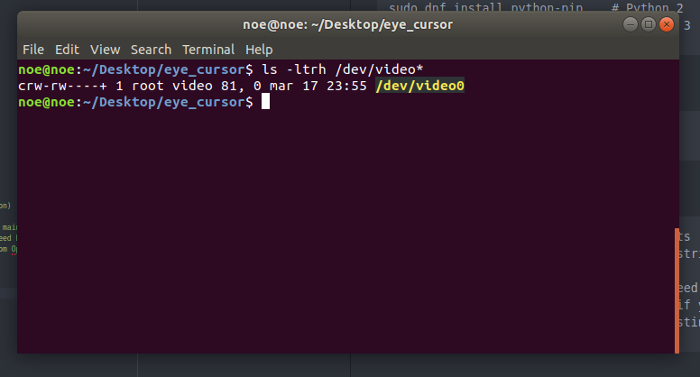
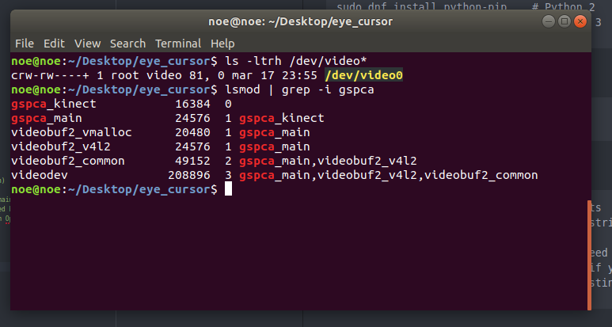

# Prepare enviroment

## Install necesary packages

1. Install python

Fedora Systems
```
sudo dnf install python
sudo dnf install python3

```
1. Install npm

```
sudo dnf install python-pip	# Python 2
sudo dnf install python3		# Python 3
```

1. Install numpy

```
sudo python3 -m pip install numpy
```

1. Install opencv to python

```
Packages for standard desktop environments
(Windows, macOS, almost any GNU/Linux distribution)

run:  pip install opencv-python if you need only main modules
run:  pip install opencv-contrib-python if you need both main and
 contrib modules (check extra modules listing from OpenCV documentation)

```
## Check Camera Linux:
```
ls -ltrh /dev/video*
or
ls -ltrh /dev/video*

```



